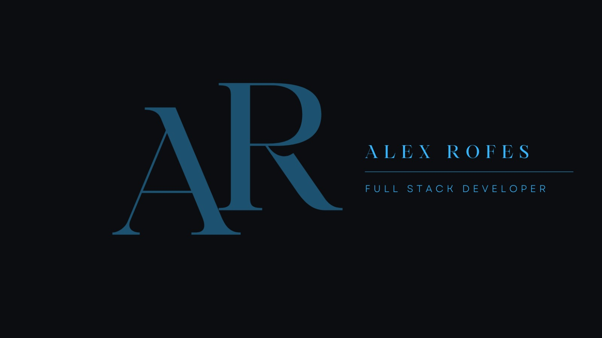
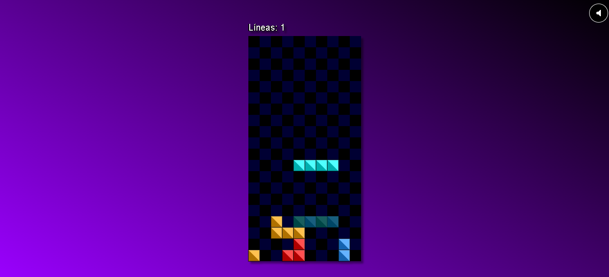
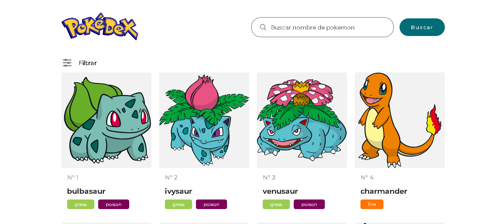
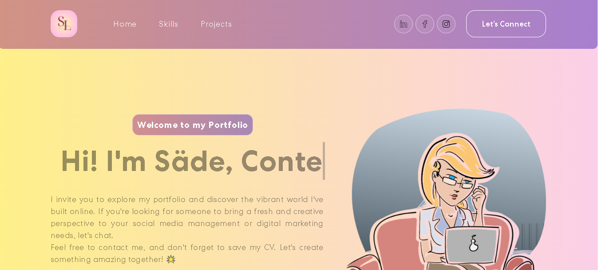
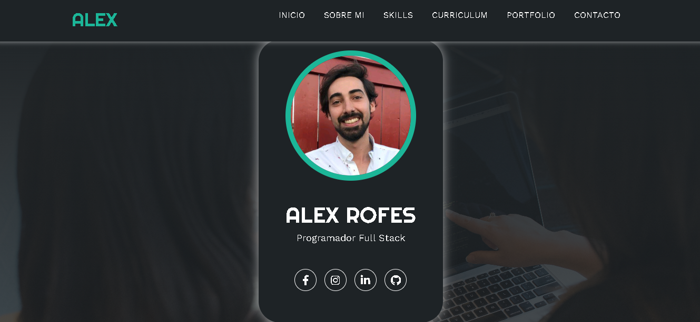

 
  

 

<h1 align="center" style="color: #ffffff;">Hola, mundo 👋🌍 Soy Alex Rofes, programador junior.</h1>
<h3 align="center" style="color: #ffffff;">Un apasionado desarrollador web fullstack de Barcelona. ¡Me considero un programador capaz de hacer cosas increíbles!</h3>

<h2 align="center" style="color: #ffffff;">Sobre mí 😎</h2>

Soy un apasionado programador con sed de conocimiento y creatividad. Mi pasión es la programación y estoy comprometido en aprender y contribuir en este emocionante campo.

 

  

 

- Estoy aprendiendo 🤓 **PHP, Python y Java en este momento**.

- Puedes preguntarme 🙋‍♀️ sobre **HTML5, CSS, JavaScript, Bootstrap, Python, Node.js, Flask y SQL**.

- Puedes contactarme en **alexrofes1992@gmail.com**. 📩

- Puedes ver mis experiencias en mi <a href="https://www.linkedin.com/in/%C3%A0lexrofesgalobardes/">Linkedin</a>. 📃

- Dato curioso: Además de programar, me encanta hacer deporte ⚽ y cocinar. 🦐

<h2 align="center" style="color: #ffffff;">⭐Proyectos destacados⭐</h2>

  

    <h3 style="color: #ffffff;">RiderMusic 🎹🎵</h3>
    
  

  

    <h3 style="color: #ffffff;">Tetris JS 🎮🕹️</h3>
    
  

  

    <h3 style="color: #ffffff;">Pokédex 🐭⚡️</h3>
    
  

  

    <h3 style="color: #ffffff;">Portfolio 🧾 React + Tailwind</h3>
    
  

  <!-- Agrega más proyectos aquí siguiendo el mismo patrón -->

<h2 align="center" style="color: #ffffff;">Mi portafolio 📝</h2>

Pagina personal donde me podras conocer un poco más. En constante construcción y progreso!🌳

<h2 align="center" style="color: #ffffff;">Conéctate conmigo</h2>
 

  
  
  
  

<h2 align="center" style="color: #ffffff;">Lenguajes y Herramientas</h2>
 

  
  
   
  
  
  
  
  
   
  
  
  
  
  

<h2 align="center" style="color: #ffffff;">Mis estadísticas</h2>
 

 

&nbsp;

